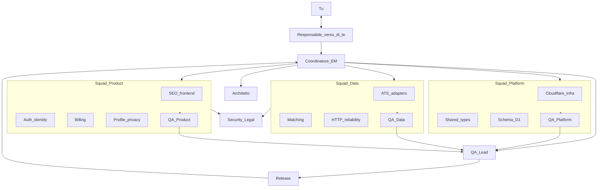

# Studio Direct — org, ruoli, esecuzione a subagenti

Questo file è il playbook del **team**. I tre piani tecnici (foundation / crawler / web) restano la spec di *cosa* costruire. Qui sta *chi* lo fa, *come* si passa il lavoro, *chi dice no*.

> Il coordinatore (sessione padre) **non implementa**. Un solo implementer alla volta sul branch. QA e security revisori **dopo** il commit, in parallelo tra loro se il task è a rischio.

**Skill di esecuzione:** `subagent-driven-development` + questo organigramma. Prompt implementer/reviewer: usare i template dello skill, **più** il blocco Ruolo sotto.



**Due voci, non mescolarle:**

| Chi | Parla con | Cosa dice |
| --- | --- | --- |
| **Responsabile verso di te** | Solo tu, in italiano, corto | Stato, prossimo passo, blocker, cosa ti serve da te. Mai dump di subagenti. |
| **Coordinatore / EM** | Solo i subagenti | Brief, review, ledger. Non implementa. |

Nella pratica è **la stessa sessione padre** che indossa il cappello Responsabile quando scrive a te, e il cappello Coordinatore quando dispatcha. Non ricevi messaggi da QA o dagli implementer.

## Ruoli (un subagente = un cappello)

Ogni dispatch **nomina il ruolo**. Il subagente non è “generico”: ha mandate, file consentiti, file vietati, DoD.

| Ruolo | Mandate | File tipici | Vietato |
| --- | --- | --- | --- |
| **Responsabile verso di te** | Unica voce umana. Aggiorna a fine task e a fine sprint. Chiede solo se sei l’unico che può sbloccare (GitHub login, Stripe, DNS, dominio). | — | Dettaglio interno, log crawler, dispute architetto |
| **Coordinatore / EM** | Sequenza task, ledger, unblocks, merge review. Non scrive prodotto. | `.superpowers/sdd/progress.md`, brief/report paths | `apps/`, `packages/`; messaggi lunghi a te |
| **Architetto** | Contratti `JobDraft` / `QueueMessage` / bindings. Dispute tra squad. Review task 2, 19, 25. | `packages/shared/src/jobs.ts`, index piani | Feature UI, nuovi ATS |
| **QA Lead** | Exit sprint: lancia i gate di squadra, launch bar spec §14. | Test commands, fixture policy | Implementare fix (manda al fixer) |
| **Security / Legal** | ToS crawl, GDPR opt-in, niente playbook anti-bot, copy Terms/Privacy. Obbligatorio su task 23–24, 37–39. | `public-fetch`, linkedin/indeed consumers, legal copy, talent-pool | Bypass, stealth, login board |
| **Release** | Stripe on/off, 300 job career, Workers Paid, DNS Email. Task 34 e go-live. | env flags, wrangler prod | Accendere Stripe prima del bar |
| **Cloudflare / infra** | wrangler.jsonc, D1 EU, Queues, KV, R2, `wrangler types`. | `**/wrangler.jsonc`, migrations apply | `wrangler.toml`, Env fatto a mano |
| **Shared types** | Normalize, slug, lock, remote, staffing, exclusivity helpers. | `packages/shared/**` | Worker fetch live |
| **Schema / D1** | SQL spec §7, Drizzle, seed. | `packages/db/**` | Tabelle extra crawl_state |
| **QA Platform** | Typecheck, vitest shared/db/crawler stub, no toml. | test files in packages + apps stubs | Inventare schema |
| **ATS adapters** | Greenhouse, Lever, JSON-LD career. | `apps/crawler/src/sources/**` | LinkedIn HTML theater come inventario |
| **Matching** | Jaccard, exclusivity, remote, staffing, ingest dedup. | `exclusivity.ts`, `ingest.ts`, `remote.ts` | Badge se indice non fresco |
| **HTTP reliability** | public-fetch, 429, host lock, crawl_runs. | `http/`, `locks/`, `runs.ts` | Cookie jar, UA rotation |
| **QA Data** | Solo fixture CI, zero rete LinkedIn/Indeed, career continua se LI fail. | `apps/crawler/test/fixtures/**` | Chiamate live in test |
| **SEO / frontend** | Pagine job, hub, sitemap, JSON-LD, cache public vs private. | `apps/web/app/jobs/**`, hubs, sitemap | Queue consumers su web |
| **Auth / identity** | Better Auth, Turnstile, magic link Email, onboarding. | `apps/web/lib/auth/**`, login, onboarding | Clerk, Resend |
| **Billing** | Stripe EUR, webhook, fail-open free. | `lib/billing/**`, stripe routes | Checkout prod prima di 300 job |
| **Profile / privacy** | Completeness, CV R2, talent-pool default off, export/delete. | profile, settings, R2 | Pagine `/talent` pubbliche |
| **QA Product** | Flussi candidato, quota 5/6, badge honesty, copy 100%/real-time. | e2e/manual checklist | Diluire i test di quota |

## Come lavora un task (cerimonia)

1. **Coordinatore** estrae il brief del task (testo dal piano) in un file. Aggiorna il ledger: `in progress`.
2. **Standup implicito:** nel dispatch, una riga: squad, ruolo implementer, QA, gate, file vietati.
3. **Implementer** (specialista): TDD, commit, report. Status `DONE` / `BLOCKED` / `NEEDS_CONTEXT`.
4. **QA di squadra** (subagente reviewer): spec + test evidence. Non ri-esegue tutta la suite se l’implementer ha già i log; verifica comandi e asserzioni.
5. **Security/Legal** in **parallelo al QA** solo se la tabella RACI dice S. Due reviewer, un fixer.
6. **Architetto** se RACI dice A sul contratto.
7. **Fixer** per Critical/Important. Re-review.
8. **Coordinatore** marca complete sul ledger. Task successivo. **Mai due implementer insieme.**

Model hint (costo): implementer meccanico (1–2 file, codice nel piano) → modello veloce. Matching/auth/billing → standard. Architetto e review finale di branch → più capace.

## RACI per i 40 task

R = implementer, A = accountable review (architetto o QA Lead), C = consulted, Q = QA squadra, S = security/legal, G = release gate.

### Squad Platform — foundation 1–10

| Task | R implementer | Q | Extra |
| --- | --- | --- | --- |
| 1 workspace | Cloudflare/infra | QA Platform | |
| 2 JobDraft/QueueMessage | Shared types | QA Platform | **A Architetto** (contratto) |
| 3 normalize/slug | Shared types | QA Platform | |
| 4 schema D1 | Schema/D1 | QA Platform | A Architetto se tabelle extra |
| 5 wrangler.jsonc | Cloudflare/infra | QA Platform | |
| 6 seed 5 company | Schema/D1 | QA Data | |
| 7 host lock | Shared types | QA Platform | C HTTP reliability |
| 8 homepage stub | SEO/frontend | QA Product | |
| 9 crawler stub | HTTP reliability | QA Data | |
| 10 cron enqueue | HTTP reliability | QA Data | |

**Sprint exit Platform (QA Lead + Coordinatore):** `pnpm test` shared/db/web-copy/crawler; D1 locale tenant+5 company; `/` claim; `/health`; zero fetch terzi; niente `wrangler.toml`; `kind` not `type`.

### Squad Data — crawler 11–25

| Task | R | Q | Extra |
| --- | --- | --- | --- |
| 11 public-fetch / 429 | HTTP reliability | QA Data | |
| 12 KV lock on fetch | HTTP reliability | QA Data | |
| 13 Greenhouse | ATS adapters | QA Data | |
| 14 Lever | ATS adapters | QA Data | |
| 15 JSON-LD | ATS adapters | QA Data | |
| 16 remote heuristic | Matching | QA Data | |
| 17 staffing | Matching | QA Data | |
| 18 ingest/dedup | Matching | QA Data | C Schema |
| 19 exclusivity | Matching | QA Data | **A Architetto** |
| 20 close stale | Matching | QA Data | |
| 21 D1 repo + career consumer | ATS + HTTP | QA Data | |
| 22 cron fan-out | HTTP reliability | QA Data | |
| 23 LinkedIn best-effort | HTTP reliability | QA Data | **S Security** |
| 24 Indeed best-effort | HTTP reliability | QA Data | **S Security** |
| 25 router + seed growth | Cloudflare/infra | QA Data | A Architetto; QA Lead |

**Sprint exit Data:** fixture CI senza rete board; career ingest scrive job; LinkedIn fail ⇒ nessun badge; Indeed può essere `[]`; README seed verso 300 job.

### Squad Product — web 26–40

| Task | R | Q | Extra |
| --- | --- | --- | --- |
| 26 `/jobs` query | SEO/frontend | QA Product | |
| 27 job page JSON-LD/badge | SEO/frontend | QA Product | C Matching (showBadge) |
| 28 homepage | SEO/frontend | QA Product | |
| 29 hubs | SEO/frontend | QA Product | |
| 30 sitemap/cache | SEO/frontend | QA Product | |
| 31 Better Auth | Auth/identity | QA Product | |
| 32 onboarding | Auth/identity | QA Product | C Profile |
| 33 unlock quota | Auth/identity | QA Product | |
| 34 Stripe | Billing | QA Product | **G Release** (no prod prima di 300) |
| 35 profile completeness | Profile/privacy | QA Product | |
| 36 CV R2 | Profile/privacy | QA Product | |
| 37 talent pool | Profile/privacy | QA Product | **S Legal** |
| 38 export/delete | Profile/privacy | QA Product | **S Legal** |
| 39 pricing/terms/privacy | SEO + Legal copy | QA Product | **S Legal** |
| 40 digest email | Billing + HTTP (crawler Cron) | QA Product | C Squad Data |

**Sprint exit Product (QA Lead + Release):** checklist spec §14; Stripe flag; digest dal crawler non da OpenNext scheduled.

## Dispatch implementer (aggiunta al template skill)

Oltre al brief del task, il coordinatore scrive:

```
Squad: {Platform|Data|Product}
Role: {nome ruolo}
You own only the Files listed in the task.
Forbidden: {from role table}
DoD: tests named in the task pass; wrangler types if you touched wrangler.jsonc.
Do not implement the next task.
QA {squad} will review after your commit. Security review: {yes|no}.
```

## Dispatch QA (aggiunta)

QA **di quella squadra** + checklist:

- **Platform:** bindings names, `wrangler.jsonc`, no handmade Env, schema §7, `kind`.
- **Data:** fixtures only, UA product, career isolation, exclusivity unknown if LI stale, no extra tables.
- **Product:** English UI, badge honesty, quota tests, no `/talent`, no unlock wall in JSON-LD description, Cloudflare-only except Stripe/Google.

## Ledger

` .superpowers/sdd/progress.md` (gitignored scratch). Una riga per task:

`Task N [Squad/Role]: complete (commits .., QA clean, Security n/a|clean)`

## Definition of Ready (prima di dispatch)

- Contratti locked nell’index non rinegoziati dall’implementer
- Task precedente complete sul ledger
- Brief contiene Files + Interfaces + test commands

## Definition of Done (task)

- Test del task verdi nel report
- QA squadra: spec ✅ e quality approved
- Security se RACI S
- Coordinatore ha scritto il ledger

## Handoff tra squad

| Da | A | Artefatto |
| --- | --- | --- |
| Platform → Data | D1 schema, seed 5, QueueMessage, crawler stub che ack | foundation green |
| Data → Product | job rows listed, exclusivity field, FTS | `/jobs` può leggere D1 |
| Product → Release | Stripe flag, legal pages, digest | launch bar |

Non si apre la squadra successiva se l’exit della precedente è rosso.

## Due PC — Cursor Origin (non GitHub)

Remote ufficiale: **Cursor Origin** (`origin.cursor.com`). Repo privato sul tuo account Cursor. Pagina: `https://cursor.com/codebase/<org>/<name>`. Nome repo: `studio-direct`.

Questo PC è **Windows nativo**. La CLI `origin` (create/push) **non è supportata su Windows fuori da WSL**. Non usiamo GitHub come piano B a meno che tu non lo chieda.

### Cosa fare prima di partire (domani)

1. `git init -b main` in `Saas JOBS`, `.gitignore` (node_modules, .wrangler, .env, `.superpowers/sdd/`), primo commit di spec+piani.
2. Creare il repo Origin in uno di questi modi:
   - **WSL** su questo PC: installare Origin CLI in WSL, `origin auth login`, `origin repo create studio-direct`, `git remote add origin <url>`, `git push -u origin main`
   - **Altro PC se è Mac/Linux:** stessa CLI, clone dopo il create
   - **UI Cursor / [cursor.com/codebase](https://cursor.com/codebase):** crea il codebase da loggato, poi `git remote add` + push da git Windows (credential helper Origin) se il remote HTTPS è già creato
3. PC 2: stesso account Cursor → Open folder / clone `origin repo clone <org>/studio-direct` (Mac/Linux/WSL) oppure clone HTTPS in Cursor.
4. Stesso account Cursor su entrambi: Settings Sync per regole IDE. **Il codice vive nel repo Origin**, non nella sync delle settings.
5. Segreti (Stripe, Google OAuth, wrangler) **mai** nel git. Su ogni PC: `wrangler secret put` e `.env` locale.

### Durante il lavoro

- Un branch `main` (o `dev`). Push a fine task. Pull sull’altro PC prima di aprire Cursor.
- Ledger `.superpowers/sdd/progress.md` è gitignore: se cambi PC a metà sprint, il coordinatore ricostruisce da `git log`.
- Non creare un secondo remote. Non `origin repo delete`.

### Quando si esegue (non ora)

Task 0 del foundation, prima del workspace pnpm: init git + Origin remote. Coordinatore lo fa una volta; Responsabile ti dice URL del codebase e “clona sul secondo PC”.
